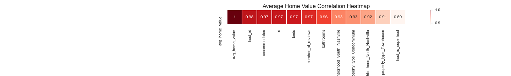
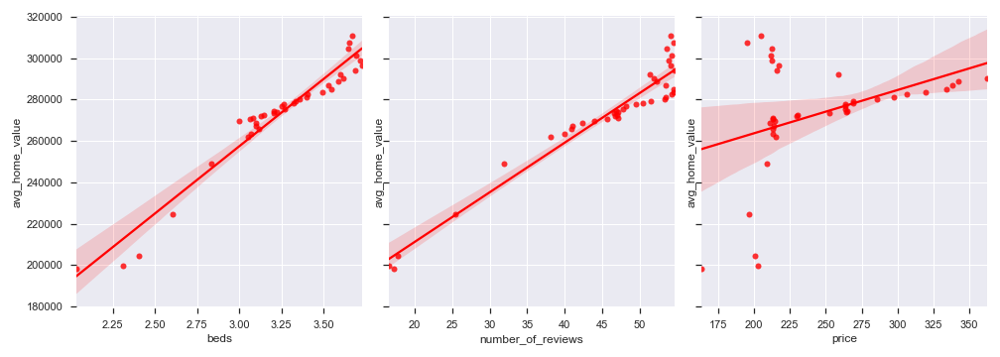
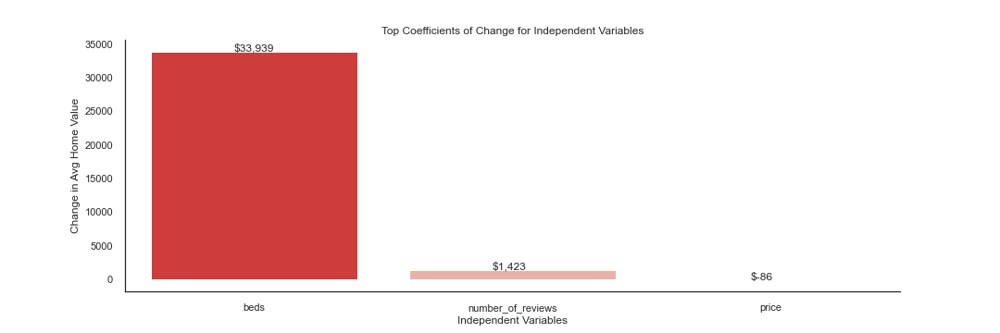
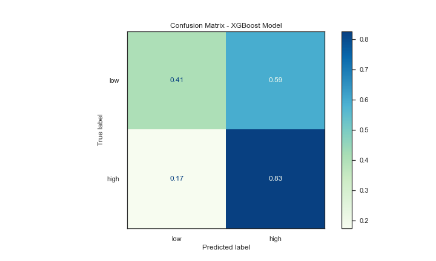

# Airbnb in Music City

## *An analysis on the relationship between Airbnb’s presence and the boom in home prices in Nashville*


**Author**: Samantha Knee

## Overview

The city of Nashville, TN has experienced explosive growth in the last 10 years, marked by hundreds of new apartment buildings and hotel development, new company headquarters from the likes of Amazon, and sharp increases in home prices. As Nashville becomes not only a more popular place to live but also a popular place to vacation, the presence of Airbnb has exploded as well, increasing from around 2,000 airbnbs in 2015 to over 6,000 today. As this city changes, I wanted to explore the relationship between the growth in home prices and the growth in Airbnb, and whether the growing popularity as a tourist city has had a negative effect on residents.

***

## Business Problem

In Davidson County (the county containing Nashville), anyone wishing to use their property on Airbnb must obtain a Short Term Rental Property (STRP) permit. The city breaks these types of permits into two types—owner-occupied and non-owner occupied. The type of rentals we are most concerned with in this project is non-owner occupied. These Airbnbs are often owned by investors for the sole purpose of making income through short-term rentals. No one lives in these properties full-time, which could be problematic for two reasons:

* Airbnb investors are purchasing homes in residential areas of Nashville attractive to tourists. This lowers the supply of homes available to a Nashville resident looking to buy, driving up the price of the remaining available homes.

* Short-term renters are less likely to respect the properties and neighborhoods they are staying in than a resident living there full-time. This has a negative effect on the neighborhood community and Nashville community at large.

In this project, I am focused on exploring the first problem, and analyzing whether the growing presence of Airbnbs has an effect on home prices. I will explore this relationship through regression and time series analysis, even making future predictions on where home prices may be headed. Lastly, I will use classification models to determine whether an Airbnb is owner-occupied or not, which could be used by the city to determine which new Airbnbs should be approved in residential areas.

***

## Data

I found my data for Airbnb from [Inside Airbnb](http://insideairbnb.com/index.html), a project put together by Murray Cox. Airbnb is not currently accepting any new access requests for their API, and only provides their API to hosts with multiple listings. Cox scrapes the Airbnb site each month for every listing; he has Airbnb data going back to 2015 for Nashville. He also included calendar data of which future dates are available to book for each active listing.

I found the data on home values in Nashville from [Zillow](https://www.zillow.com/research/data/). I used the Zillow Home Value Index (ZHVI) for each zipcode and the typical home value in the Nashville MSA. The ZHVI is calculated by measuring monthly changes in property-level Zestimates. Zillow has this data going back to 1996 for most zipcodes, with some zipcode data starting in 2005.

***

## Methods

### Cleaning and EDA

The data from Inside Airbnb contained many missing values which needed to be handled. Datatypes needed to be changed including datetime columns. I also dropped any columns that had too similar of information to try to limit multicollinearity in any of the models. I engineered new features such as occupancy rate and estimated monthly income to explore how the use of Airbnb has trended over the last several years. 

After one-hot encoding any categorical variables, I created two main DataFrames to use as starting points in each model. The first was a DataFrame of only current Airbnbs in Nashville, which included a column for number of available days in 2021. The second was a DataFrame with a time series index that included the average home value in Nashville for a certain month and columns that represented the presence/qualities of Airbnb at that time. The continuous columns in this DataFrame represent the average quality of an Airbnb at the time, for example, a value of 3 for beds means the average Airbnb had 3 beds at the time. For categorical columns, the value represents the number of Airbnbs that had a certain feature. For example, a value of 39 for “room_type_Private room” means there were 39 Airbnbs labeled as Private room at the time.

### Regression Models to Explore Relationship Between Home Values and Airbnbs

The purpose of the regression analysis is to determine if there is a significant relationship between the average home value and the qualities of the Airbnbs, including where the airbnbs are located, the average price, the average number of beds, and the average number of reviews on each property.

After I explored the correlation between many of the features of the Airbnb’s, I performed stepwise selection with a subset of features that were found to be highly correlated to the average home value. I checked my results against a baseline simple regression model using the average number of reviews on an Airbnb as the predictor. I also checked that the assumptions of linear regression were met for the models.



### Time Series Models to Predict Future Home Values

For the time series analysis, I used SARIMA and SARIMAX models to predict home price values, because the time series data was not stationary. I selected the best model to use based on AIC values. 


### Classifying Airbnb Availability

Since the city of Nashville is focused on limiting non-owner-occupied rentals, I engineered an availability metric using the current listings and calendar data for each active Airbnb.  If a listing has availability in 2021 of more than 90 days, it is likely safe to assume the owner does not live at the property, and it will be classified as a highly available property. All listings with availability of less than 90 days would be considered low availability, and likely not as problematic for the city. The idea is to create a model that classifies each property and could be used on any additional Airbnb permits. If the model classifies the applying property as highly available, the city can reject the permit.

I iterated through several classification models to see which model could best classify whether an Airbnb would be highly available. Types of algorithms used include K-Nearest Neighbors, Random Forests, gradient boosting and XGBoost. Grid Search was performed on each algorithm to improve overfitting and cross validation was used to confirm performance results. Class imbalance also needed to be taken into account, as there are more Airbnbs in Nashville with high availability than low availability.


***

## Results

### Regression: Is there a signficant relationship between home values and Airbnbs?

In the final regression model, we found the average number of beds, average number of reviews, number of Superhosts and number of Airbnbs in North Nashville had a significant relationship with the average home value.




The largest effect on home value came from the number of beds—an increase in the average number of beds by 1 causes a $35k increase in home value. This could be because as Airbnb’s become larger and can fit more people, the more valuable the average home becomes to an Airbnb owner.

### Time Series: Can we predict future average home values?

Based on AIC values, the best performing model was a SARIMA model with order of (1,1,1) and seasonal order of (1,1,1,12). Using exogenous parameters did not improve our predictions.


### Classification: Can we predict whether or not an Airbnb will be highly available?

The model that had the least overfitting was the K-Nearest Neighbors model. However, due to much better test results, I decided to use an XGBoost model as my final model.


The final XGBoost model had an accuracy score of 0.78, a precision score of 0.81, a recall score of 0.82 and an F1 score of 0.80.




The features the XGBoost model found to be most important in determining whether or not a home would be highly available is whether the home is a Townhome or condominium, whether the home is in Donelson, North Nashville, or Parkwood, and how many people the home accommodates. 

***

## Conclusions

**Limit the number of beds that can be available in an Airbnb.** As the average number of beds increased, so did the average home value. As Airbnbs became more popular, it is possible the owners tried to add beds in order to accommodate more visitors and therefore be able to charge a higher price per night. Limiting the number of beds could curb the visitors in very large groups and make owning an Airbnb less attractive.

**Use the time series model to make a decision to buy a house.** According to the SARIMA model, the average home in Nashville will be worth more than $400k by June 2023. First time home buyers looking to get into the market should do so soon, as the trend of increasing home prices is highly likely to continue.

**Use the classification model to determine whether to approve a new Airbnb.** The city can use the XGBoost model to predict whether or not a new Airbnb is going to be highly available, and therefore a non-owner occupied unit. This should curb the effect of Airbnb on home prices, as the number of investor properties will be limited to what is present today.

## Next Steps

**Run neighborhood specific models.** With more time and resources, I would like to explore what all of these models would look like for each individual neighborhood. Is there a type of home in North Nashville that is more likely to be owner-occupied? Are there certain Airbnb qualities in East Nashville correlated with rising home values in that area? Having answers to these questions for each area would be very helpful and could be used to set different policies in each neighborhood.

**Explore demographic changes in Nashville.** It would be interesting to see if how demographics like age, race, and income have changed in Nashville have a significant relationship with the change in home prices.

**Use deep learning.** I would also like to see if I could use neural networks to achieve better results on our classification model. Although it is not as easy to interpret the process of a neural network, they could help make the model the city uses even more accurate for classifying the availability of Airbnbs.

## For More Information

Please review the following notebooks in the repository for [initial EDA], [additional pre-model cleaning], [regression models], [time series models] and [classification models]. Please also review this [presentation] and visit [this site] to see an interactive dashboard of my findings.

Please review the EDA in this [Jupyter Notebook](./Housing%20Data%20-%20EDA.ipynb), the full modeling analysis in this [Jupyter Notebook](./Housing%20Data%20-%20Modeling.ipynb), and this [presentation](./House_Price_Analysis_Presentation.pdf).

For any additional questions, please contact **Samantha Knee at samanthaknee24@gmail.com**


## Repository Structure UPDATE THIS


```
├── README.md                                 <- The top-level README for reviewers of this project
├── Housing Data - EDA.ipynb                  <- Narrative documentation of data cleaning in Jupyter notebook
├── Housing Data - Modeling.ipynb             <- Narrative documentation of analysis in Jupyter notebook
├── House_Price_Analysis_Presentation.pdf     <- PDF version of project presentation
├── data                                      <- Both sourced externally and generated from code
└── images                                    <- Both sourced externally and generated from code
```